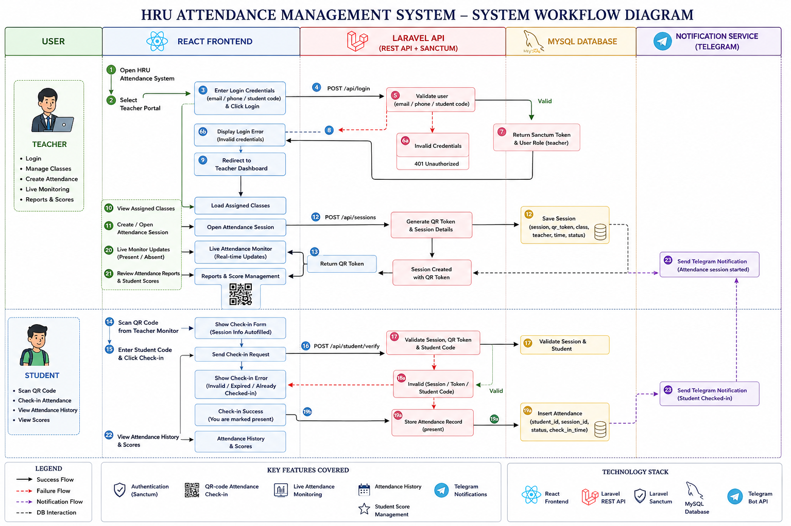
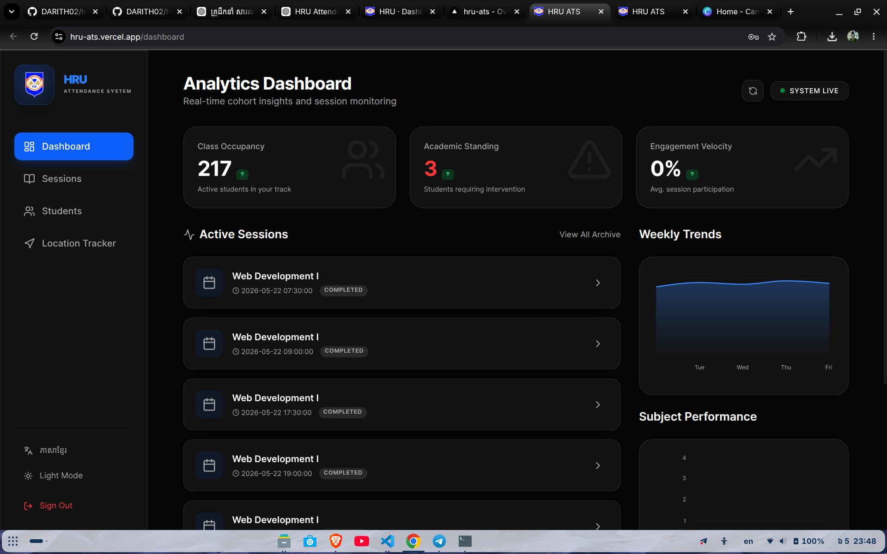
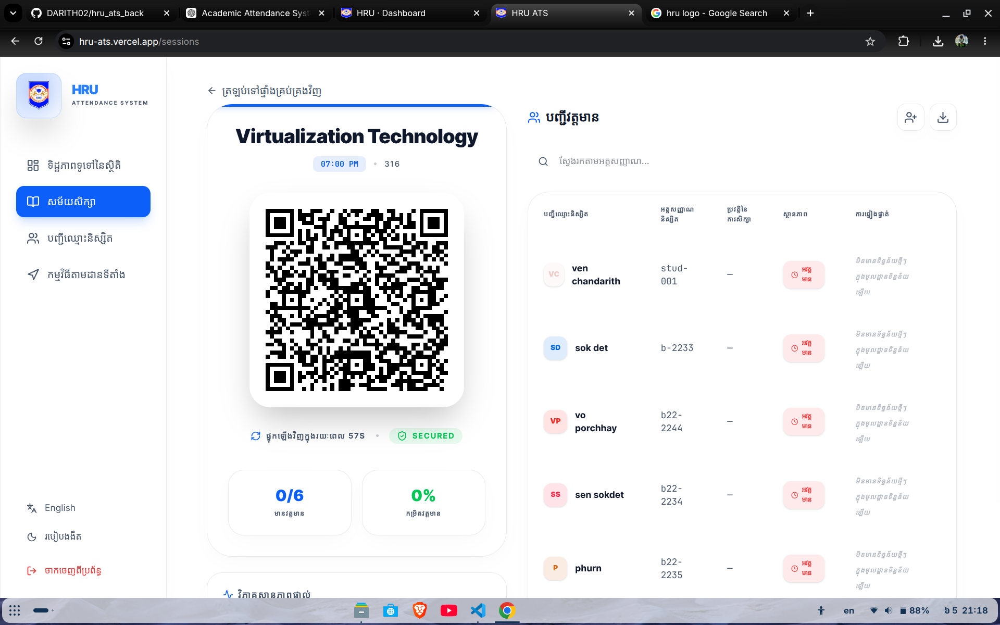
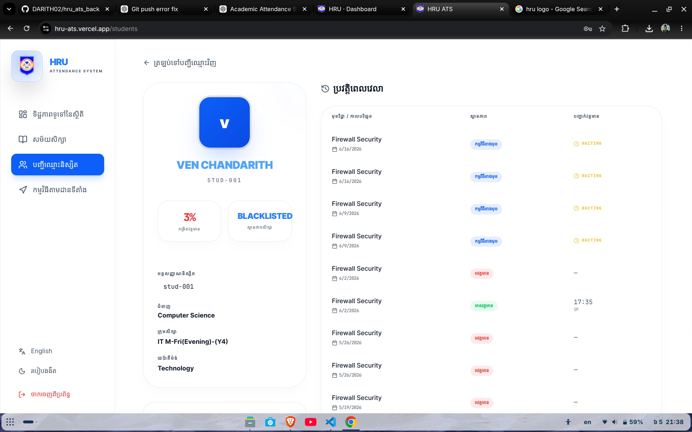
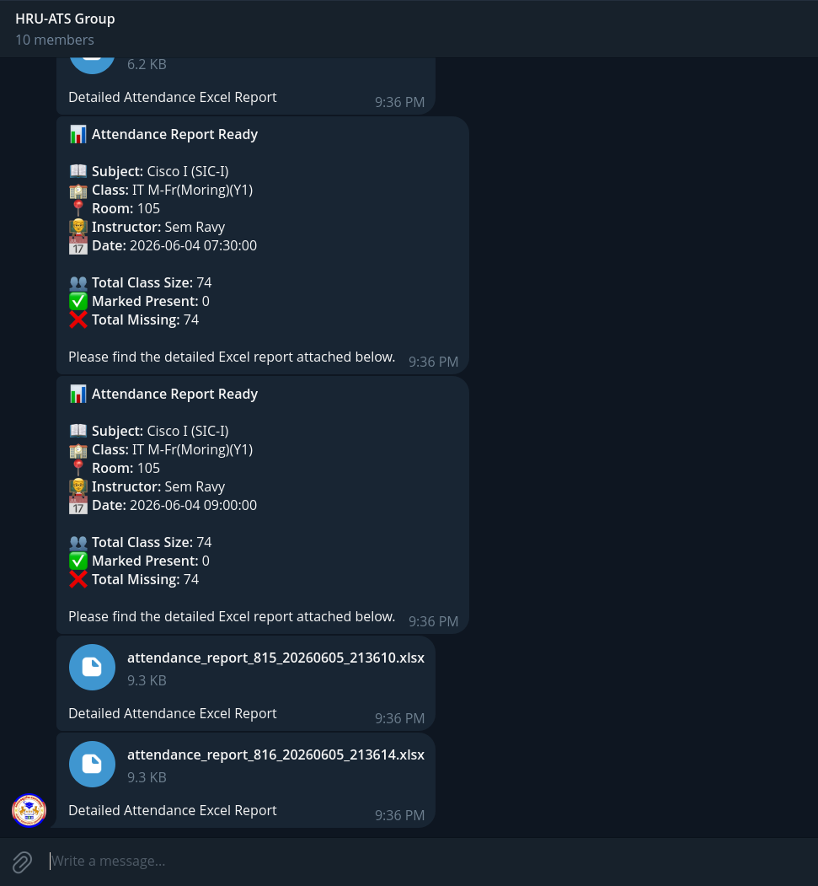
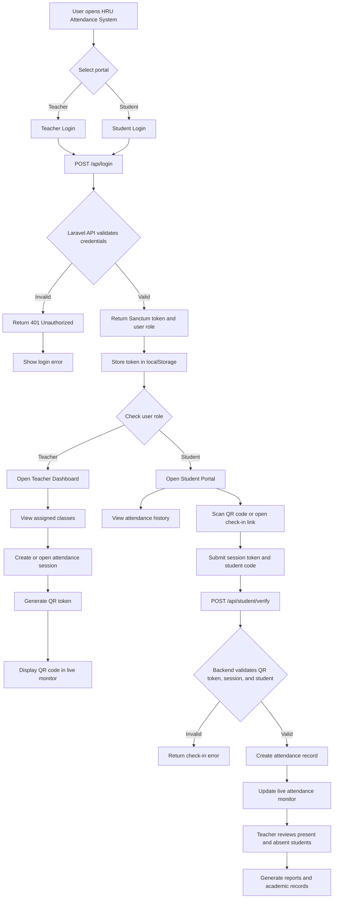
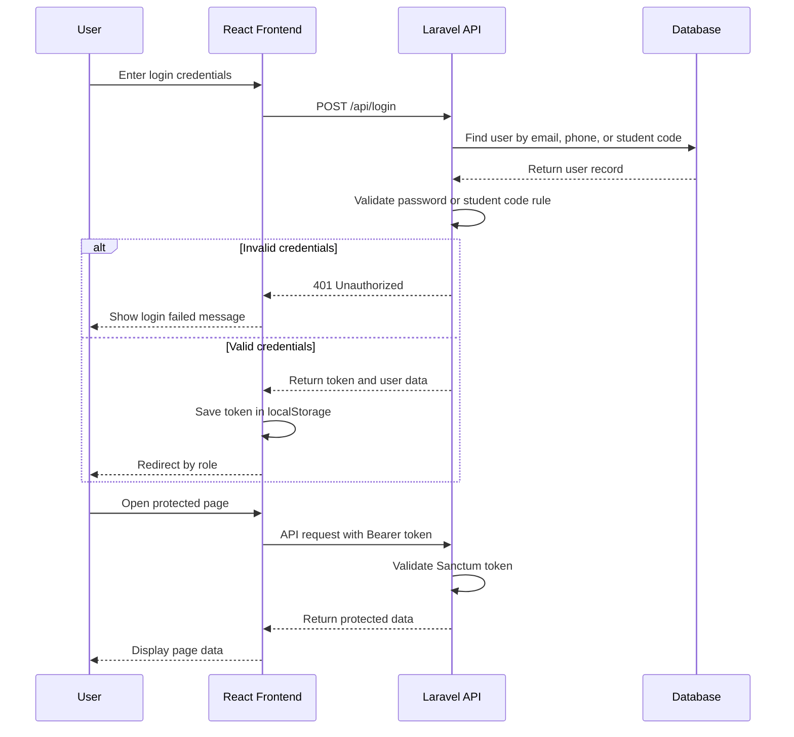
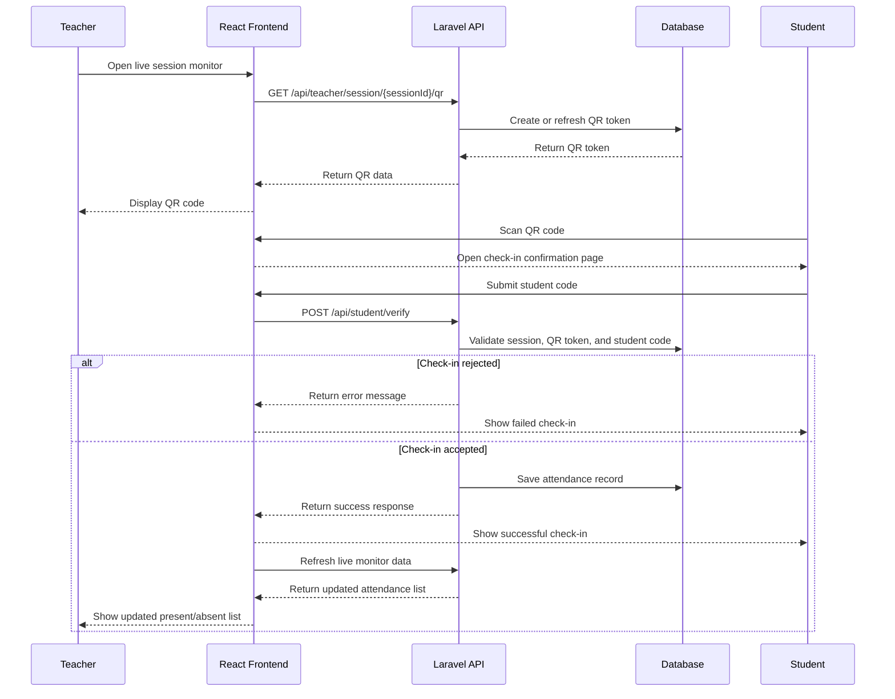
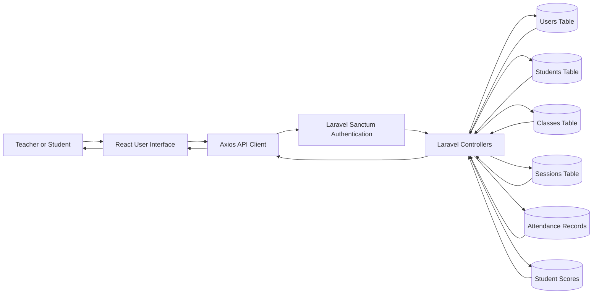

# HRU Attendance Tracking System

# ប្រព័ន្ធគ្រប់គ្រងវត្តមាន HRU-ATS

<div align="center">
  
  <br />
  <strong>Students Attendance Management System</strong>
  <br />
  <strong>ប្រព័ន្ធគ្រប់គ្រងវត្តមាននិស្សិត</strong>
</div>

---
## Project Images / រូបភាពគម្រោង
---

### University / សាកលវិទ្យាល័យ


---

### Workflow diagram​ Image for a web-based HRU-ATS / ប្រពន្ធ័គ្រប់គ្រងវត្ដមាននិស្សិត



### Dashboard / ផ្ទាំងគ្រប់គ្រង



### QR Attendance / វត្តមានតាម QR Code



### Attendance Report / របាយការណ៍វត្តមាន



### Telegram Notification / ការជូនដំណឹងតាម Telegram



### Supervisor / គ្រូដឹកនាំ


### Team Work / ការងារជាក្រុម


### Developer && Leader


---

## 1. Project Description

The HRU Attendance System Frontend is a web-based academic attendance management interface developed for Human Resource University (HRU). The system provides digital portals for teachers and students, allowing teachers to manage attendance sessions, monitor student attendance in real time, generate QR-based check-in sessions, review attendance records, and manage academic scores. Students can access their portal to view attendance history, scan QR codes, and confirm their presence.

This frontend is developed with React and communicates with a Laravel REST API backend. The main purpose of the system is to improve the speed, accuracy, transparency, and reliability of academic attendance management by replacing manual paper-based attendance workflows with a centralized digital platform.

## ១. សេចក្តីពិពណ៌នាគម្រោង

ប្រព័ន្ធគ្រប់គ្រងវត្តមាន HRU Frontend គឺជាផ្នែកមុខនៃប្រព័ន្ធគ្រប់គ្រងវត្តមានសិក្សាតាមបណ្ដាញ ដែលត្រូវបានអភិវឌ្ឍសម្រាប់សាកលវិទ្យាល័យ Human Resource University (HRU)។ ប្រព័ន្ធនេះផ្តល់ច្រកចូលប្រើប្រាស់ឌីជីថលសម្រាប់សាស្ត្រាចារ្យ និងនិស្សិត ដោយអនុញ្ញាតឱ្យសាស្ត្រាចារ្យគ្រប់គ្រងវគ្គវត្តមាន តាមដានវត្តមាននិស្សិតជាក់ស្តែង បង្កើតវគ្គ Check-in តាម QR Code ពិនិត្យកំណត់ត្រាវត្តមាន និងគ្រប់គ្រងពិន្ទុសិក្សា។ និស្សិតអាចចូលទៅកាន់ Portal របស់ខ្លួន ដើម្បីមើលប្រវត្តិវត្តមាន ស្កេន QR Code និងបញ្ជាក់វត្តមាន។

Frontend នេះត្រូវបានអភិវឌ្ឍដោយប្រើ React និងធ្វើការទំនាក់ទំនងជាមួយ Laravel REST API Backend។ គោលបំណងសំខាន់នៃប្រព័ន្ធនេះគឺធ្វើឱ្យការគ្រប់គ្រងវត្តមានសិក្សាមានភាពលឿន ត្រឹមត្រូវ មានតម្លាភាព និងអាចទុកចិត្តបាន ដោយជំនួសការកត់វត្តមានលើក្រដាសដោយវេទិកាឌីជីថលកណ្ដាល។

---

## 2. Background of the Study

Attendance management is an important part of academic administration. Traditional attendance methods often depend on manual recording, paper sheets, or spreadsheets. These methods can be slow, difficult to verify, and vulnerable to human error. In large classes, manual attendance checking also consumes teaching time and may result in inaccurate records.

The HRU Attendance System introduces a digital attendance workflow. Teachers can create and monitor attendance sessions, while students confirm their presence using QR codes and student identifiers. This improves attendance accuracy, reduces manual work, and provides real-time information for academic monitoring.

## ២. ផ្ទៃខាងក្រោយនៃការសិក្សា

ការគ្រប់គ្រងវត្តមានគឺជាផ្នែកសំខាន់មួយនៃការគ្រប់គ្រងសិក្សា។ វិធីសាស្ត្រកត់វត្តមានបែបប្រពៃណីជាញឹកញាប់ពឹងផ្អែកលើការកត់ត្រាដោយដៃ សន្លឹកក្រដាស ឬតារាង Spreadsheet។ វិធីសាស្ត្រទាំងនេះអាចយឺត ពិបាកផ្ទៀងផ្ទាត់ និងងាយកើតកំហុសមនុស្ស។ នៅក្នុងថ្នាក់ដែលមាននិស្សិតច្រើន ការត្រួតពិនិត្យវត្តមានដោយដៃក៏ចំណាយពេលបង្រៀន ហើយអាចបណ្តាលឱ្យកំណត់ត្រាមានភាពមិនត្រឹមត្រូវ។

ប្រព័ន្ធគ្រប់គ្រងវត្តមាន HRU បានណែនាំដំណើរការកត់វត្តមានឌីជីថល។ សាស្ត្រាចារ្យអាចបង្កើត និងតាមដានវគ្គវត្តមាន ខណៈនិស្សិតអាចបញ្ជាក់វត្តមានតាម QR Code និងលេខសម្គាល់និស្សិត។ វាជួយបង្កើនភាពត្រឹមត្រូវនៃវត្តមាន កាត់បន្ថយការងារដោយដៃ និងផ្តល់ព័ត៌មានជាក់ស្តែងសម្រាប់ការតាមដានសិក្សា។

---

## 3. Problem Statement

Manual attendance systems create several problems:

- Attendance records may be inaccurate because of human error.
- Teachers spend unnecessary time checking attendance manually.
- Administrators may have difficulty reviewing reports quickly.
- Students may not easily access their attendance history.
- Paper records can be lost, damaged, or duplicated.
- Real-time class attendance monitoring is difficult without a centralized system.

## ៣. បញ្ហាដែលត្រូវដោះស្រាយ

ប្រព័ន្ធកត់វត្តមានដោយដៃបង្កបញ្ហាជាច្រើន៖

- កំណត់ត្រាវត្តមានអាចមិនត្រឹមត្រូវដោយសារកំហុសមនុស្ស។
- សាស្ត្រាចារ្យចំណាយពេលមិនចាំបាច់ក្នុងការត្រួតពិនិត្យវត្តមានដោយដៃ។
- រដ្ឋបាលអាចពិបាកពិនិត្យរបាយការណ៍ឱ្យបានលឿន។
- និស្សិតមិនងាយស្រួលចូលមើលប្រវត្តិវត្តមានរបស់ខ្លួន។
- កំណត់ត្រាលើក្រដាសអាចបាត់ ខូច ឬត្រូវបានចម្លងខុស។
- ការតាមដានវត្តមានថ្នាក់ជាក់ស្តែងមានភាពពិបាក ប្រសិនបើគ្មានប្រព័ន្ធកណ្ដាល។

---

## 4. Project Objectives

The main objective of this project is to develop a frontend system for managing academic attendance efficiently and accurately.

Specific objectives:

- Provide a teacher portal for managing attendance sessions.
- Provide a student portal for viewing attendance history.
- Support QR-code-based attendance verification.
- Allow teachers to monitor live attendance sessions.
- Display student attendance records clearly.
- Connect the React frontend with a Laravel API backend.
- Improve access to attendance data for teachers, students, and administrators.

## ៤. គោលបំណងនៃគម្រោង

គោលបំណងចម្បងនៃគម្រោងនេះគឺអភិវឌ្ឍប្រព័ន្ធ Frontend សម្រាប់គ្រប់គ្រងវត្តមានសិក្សាឱ្យមានប្រសិទ្ធភាព និងភាពត្រឹមត្រូវ។

គោលបំណងជាក់លាក់៖

- ផ្តល់ Portal សម្រាប់សាស្ត្រាចារ្យក្នុងការគ្រប់គ្រងវគ្គវត្តមាន។
- ផ្តល់ Portal សម្រាប់និស្សិតក្នុងការមើលប្រវត្តិវត្តមាន។
- គាំទ្រការបញ្ជាក់វត្តមានតាម QR Code។
- អនុញ្ញាតឱ្យសាស្ត្រាចារ្យតាមដានវត្តមានជាក់ស្តែង។
- បង្ហាញកំណត់ត្រាវត្តមាននិស្សិតឱ្យច្បាស់លាស់។
- ភ្ជាប់ React Frontend ជាមួយ Laravel API Backend។
- បង្កើនភាពងាយស្រួលក្នុងការចូលប្រើទិន្នន័យវត្តមានសម្រាប់សាស្ត្រាចារ្យ និស្សិត និងរដ្ឋបាល។

---

## 5. Scope of the Project

This frontend project covers the user interface and client-side logic for the HRU Attendance System. It includes login screens, teacher dashboard, student portal, session monitoring, QR code check-in, attendance history, student directory, score management, API communication, and environment configuration.

The frontend does not directly manage database operations or backend business logic. Those responsibilities are handled by the Laravel API backend.

## ៥. ដែនកំណត់នៃគម្រោង

គម្រោង Frontend នេះគ្របដណ្តប់លើ User Interface និង Client-side Logic សម្រាប់ប្រព័ន្ធគ្រប់គ្រងវត្តមាន HRU។ វារួមមានទំព័រ Login, Teacher Dashboard, Student Portal, ការតាមដានវគ្គសិក្សា, ការ Check-in តាម QR Code, ប្រវត្តិវត្តមាន, បញ្ជីនិស្សិត, ការគ្រប់គ្រងពិន្ទុ, ការទំនាក់ទំនង API និងការកំណត់ Environment។

Frontend មិនគ្រប់គ្រង Database Operations ឬ Backend Business Logic ដោយផ្ទាល់ទេ។ ការងារទាំងនោះត្រូវបានគ្រប់គ្រងដោយ Laravel API Backend។

---

## 6. System Users

### Teacher

Teachers can log in, view assigned classes, manage attendance sessions, generate QR codes, monitor live attendance, manually check in students, review attendance history, and manage scores.

### Student

Students can log in, view attendance history, scan QR codes, submit their student identifier, and view class-related attendance information.

### Administrator

Administrative data such as students, classes, subjects, and attendance records are mainly managed by the backend/admin system. The frontend consumes and displays this data through the API.

## ៦. អ្នកប្រើប្រាស់ប្រព័ន្ធ

### សាស្ត្រាចារ្យ

សាស្ត្រាចារ្យអាចចូលប្រើប្រព័ន្ធ មើលថ្នាក់ដែលបានកំណត់ឱ្យ គ្រប់គ្រងវគ្គវត្តមាន បង្កើត QR Code តាមដានវត្តមានជាក់ស្តែង បញ្ចូលវត្តមាននិស្សិតដោយដៃ ពិនិត្យប្រវត្តិវត្តមាន និងគ្រប់គ្រងពិន្ទុ។

### និស្សិត

និស្សិតអាចចូលប្រើប្រព័ន្ធ មើលប្រវត្តិវត្តមាន ស្កេន QR Code បញ្ចូលលេខសម្គាល់និស្សិត និងមើលព័ត៌មានវត្តមានដែលទាក់ទងនឹងថ្នាក់របស់ខ្លួន។

### អ្នកគ្រប់គ្រងប្រព័ន្ធ

ទិន្នន័យរដ្ឋបាលដូចជា និស្សិត ថ្នាក់ មុខវិជ្ជា និងកំណត់ត្រាវត្តមាន ត្រូវបានគ្រប់គ្រងជាចម្បងដោយ Backend/Admin System។ Frontend ប្រើប្រាស់ និងបង្ហាញទិន្នន័យទាំងនេះតាម API។

---

## 7. Main Features

- Role-based login for teachers and students.
- Teacher dashboard for attendance summaries.
- QR-code-based attendance verification.
- Live session monitoring.
- Student portal and attendance history.
- Student directory and academic score management.
- API integration with Laravel backend.
- Telegram notification support through backend integration.

## ៧. មុខងារសំខាន់ៗ

- ការចូលប្រើប្រាស់តាមតួនាទីសម្រាប់សាស្ត្រាចារ្យ និងនិស្សិត។
- Teacher Dashboard សម្រាប់មើលសង្ខេបវត្តមាន។
- ការបញ្ជាក់វត្តមានតាម QR Code។
- ការតាមដានវគ្គសិក្សាជាក់ស្តែង។
- Student Portal និងប្រវត្តិវត្តមាន។
- បញ្ជីនិស្សិត និងការគ្រប់គ្រងពិន្ទុសិក្សា។
- ការភ្ជាប់ API ជាមួយ Laravel Backend។
- ការគាំទ្រការជូនដំណឹងតាម Telegram តាមរយៈ Backend Integration។

---

## 8. Technology Stack

### Frontend

- React
- Vite
- React Router
- Axios
- Tailwind CSS
- Motion animations
- Lucide React icons
- QR code and QR scanner libraries

### Backend API

- Laravel REST API
- Laravel Sanctum authentication
- MySQL database

### Development Tools

- Node.js
- npm
- Vite development server

## ៨. បច្ចេកវិទ្យាដែលបានប្រើ

### Frontend

- React
- Vite
- React Router
- Axios
- Tailwind CSS
- Motion Animations
- Lucide React Icons
- QR Code និង QR Scanner Libraries

### Backend API

- Laravel REST API
- Laravel Sanctum Authentication
- MySQL Database

### ឧបករណ៍អភិវឌ្ឍន៍

- Node.js
- npm
- Vite Development Server

---

## 9. System Architecture

```text
User Browser
    |
    | React Frontend
    |
Axios HTTP Requests
    |
Laravel REST API
    |
Database
```

The frontend displays pages, collects user input, stores authentication tokens, and sends requests to the backend API. The backend handles authentication, authorization, database operations, attendance validation, session management, and response data.

## ៩. ស្ថាបត្យកម្មប្រព័ន្ធ

```text
User Browser
    |
    | React Frontend
    |
Axios HTTP Requests
    |
Laravel REST API
    |
Database
```

Frontend ទទួលខុសត្រូវលើការបង្ហាញទំព័រ ទទួលទិន្នន័យពីអ្នកប្រើប្រាស់ រក្សាទុក Authentication Token និងផ្ញើ Request ទៅ Backend API។ Backend ទទួលខុសត្រូវលើ Authentication, Authorization, Database Operations, Attendance Validation, Session Management និងការផ្តល់ទិន្នន័យត្រឡប់មកវិញ។

---

## 10. Full Project Workflow Diagram

This diagram shows the complete workflow of the HRU Attendance System from user access to attendance reporting.

## ១០. ដ្យាក្រាមដំណើរការពេញលេញនៃគម្រោង

ដ្យាក្រាមនេះបង្ហាញដំណើរការពេញលេញរបស់ប្រព័ន្ធគ្រប់គ្រងវត្តមាន HRU ចាប់ពីការចូលប្រើប្រាស់របស់អ្នកប្រើ រហូតដល់ការបង្កើតរបាយការណ៍វត្តមាន។



---

## 11. Authentication Workflow

This diagram explains how users log in and how protected API requests are handled.

## ១១. ដ្យាក្រាមដំណើរការ Authentication

ដ្យាក្រាមនេះពន្យល់ពីរបៀបដែលអ្នកប្រើប្រាស់ចូលប្រព័ន្ធ និងរបៀបដែល API Request ដែលមានការការពារត្រូវបានដំណើរការ។



---

## 12. QR Attendance Check-In Workflow

This diagram shows the QR attendance check-in process between teacher, student, frontend, backend, and database.

## ១២. ដ្យាក្រាមដំណើរការ Check-In តាម QR Code

ដ្យាក្រាមនេះបង្ហាញដំណើរការកត់វត្តមានតាម QR Code រវាងសាស្ត្រាចារ្យ និស្សិត Frontend Backend និង Database។



---

## 13. Data Flow Diagram

This diagram summarizes the main data movement between the frontend, backend, and database.

## ១៣. ដ្យាក្រាមលំហូរទិន្នន័យ

ដ្យាក្រាមនេះសង្ខេបលំហូរទិន្នន័យសំខាន់ៗរវាង Frontend Backend និង Database។



---

## 14. API Configuration

The frontend API base URL is configured in `.env`.

Local development:

```env
VITE_API_BASE_URL=http://localhost:8080/api
```

Production:

```env
VITE_API_BASE_URL=https://hru-ats.laravel.cloud/api
```

Axios API client:

```text
src/lib/api.js
```

## ១៤. ការកំណត់ API

Base URL របស់ Frontend API ត្រូវបានកំណត់ក្នុង `.env`។

Local Development៖

```env
VITE_API_BASE_URL=http://localhost:8080/api
```

Production៖

```env
VITE_API_BASE_URL=https://hru-ats.laravel.cloud/api
```

Axios API Client៖

```text
src/lib/api.js
```

---

## 15. Authentication Flow

1. The user selects a portal: teacher or student.
2. The user submits login credentials.
3. The frontend sends a request to `POST /api/login`.
4. The backend validates credentials and returns a token.
5. The frontend stores the token in `localStorage`.
6. Future requests include the token as a Bearer token.
7. The application displays pages based on the authenticated user role.

## ១៥. ដំណើរការ Authentication

1. អ្នកប្រើប្រាស់ជ្រើសរើស Portal៖ សាស្ត្រាចារ្យ ឬនិស្សិត។
2. អ្នកប្រើប្រាស់បញ្ចូលព័ត៌មានចូលប្រើប្រាស់។
3. Frontend ផ្ញើ Request ទៅ `POST /api/login`។
4. Backend ផ្ទៀងផ្ទាត់ព័ត៌មាន និងផ្តល់ Token ត្រឡប់មកវិញ។
5. Frontend រក្សាទុក Token ក្នុង `localStorage`។
6. Request បន្ទាប់ៗនឹងភ្ជាប់ Token ជា Bearer Token។
7. កម្មវិធីបង្ហាញទំព័រតាមតួនាទីរបស់អ្នកប្រើប្រាស់។

---

## 16. Project Structure

```text
src/
├── components/
│   ├── Login.jsx
│   ├── Layout.jsx
│   ├── TeacherDashboard.jsx
│   ├── TeacherSessions.jsx
│   ├── TeacherStudents.jsx
│   ├── TeacherScores.jsx
│   ├── StudentPortal.jsx
│   ├── StudentHistory.jsx
│   └── StudentCheckIn.jsx
├── context/
│   └── AppContext.jsx
├── lib/
│   ├── api.js
│   ├── location.js
│   └── utils.js
└── App.jsx
```

## ១៦. រចនាសម្ព័ន្ធគម្រោង

```text
src/
├── components/
│   ├── Login.jsx
│   ├── Layout.jsx
│   ├── TeacherDashboard.jsx
│   ├── TeacherSessions.jsx
│   ├── TeacherStudents.jsx
│   ├── TeacherScores.jsx
│   ├── StudentPortal.jsx
│   ├── StudentHistory.jsx
│   └── StudentCheckIn.jsx
├── context/
│   └── AppContext.jsx
├── lib/
│   ├── api.js
│   ├── location.js
│   └── utils.js
└── App.jsx
```

---

## 17. Installation and Setup

### Prerequisites

- Node.js
- npm
- Running Laravel backend API

### Install Dependencies

```bash
npm install
```

### Configure Environment

```env
VITE_API_BASE_URL=http://localhost:8080/api
VITE_APP_URL=http://localhost:3000
```

### Run Development Server

```bash
npm run dev
```

Development URL:

```text
http://localhost:3000
```

### Build for Production

```bash
npm run build
```

Output directory:

```text
dist/
```

## ១៧. ការដំឡើង និងការរៀបចំប្រព័ន្ធ

### តម្រូវការមុនដំឡើង

- Node.js
- npm
- Laravel Backend API ដែលកំពុងដំណើរការ

### ដំឡើង Dependencies

```bash
npm install
```

### កំណត់ Environment

```env
VITE_API_BASE_URL=http://localhost:8080/api
VITE_APP_URL=http://localhost:3000
```

### ដំណើរការ Development Server

```bash
npm run dev
```

Development URL៖

```text
http://localhost:3000
```

### Build សម្រាប់ Production

```bash
npm run build
```

Output Directory៖

```text
dist/
```

---

## 18. Expected Benefits

- Reduces manual attendance work for teachers.
- Improves accuracy of attendance records.
- Provides real-time attendance monitoring.
- Gives students access to their attendance history.
- Helps teachers identify students with low attendance.
- Supports better academic reporting and decision-making.
- Centralizes attendance data in one digital platform.

## ១៨. អត្ថប្រយោជន៍ដែលរំពឹងទុក

- កាត់បន្ថយការងារកត់វត្តមានដោយដៃសម្រាប់សាស្ត្រាចារ្យ។
- បង្កើនភាពត្រឹមត្រូវនៃកំណត់ត្រាវត្តមាន។
- ផ្តល់ការតាមដានវត្តមានជាក់ស្តែង។
- អនុញ្ញាតឱ្យនិស្សិតចូលមើលប្រវត្តិវត្តមានរបស់ខ្លួន។
- ជួយសាស្ត្រាចារ្យសម្គាល់និស្សិតដែលមានវត្តមានទាប។
- គាំទ្រការធ្វើរបាយការណ៍ និងការសម្រេចចិត្តសិក្សាឱ្យប្រសើរឡើង។
- ប្រមូលផ្តុំទិន្នន័យវត្តមាននៅក្នុងវេទិកាឌីជីថលតែមួយ។

---

## 19. Limitations

This frontend depends on the Laravel backend API. If the backend is unavailable, misconfigured, or rejects authentication, the frontend cannot complete login or load protected data. Student login behavior also depends on backend authentication rules and production environment settings.

## ១៩. ដែនកំណត់

Frontend នេះពឹងផ្អែកលើ Laravel Backend API។ ប្រសិនបើ Backend មិនដំណើរការ កំណត់មិនត្រឹមត្រូវ ឬបដិសេធ Authentication នោះ Frontend មិនអាចចូលប្រើប្រាស់ ឬផ្ទុកទិន្នន័យដែលការពារបានទេ។ ឥរិយាបថ Login របស់និស្សិតក៏អាស្រ័យលើច្បាប់ Authentication របស់ Backend និងការកំណត់ Environment ក្នុង Production ផងដែរ។

---

## 20. Conclusion

The HRU Attendance System Frontend is a digital solution for improving academic attendance management. By combining role-based access, QR-code attendance verification, live monitoring, attendance history, and score management, the system helps reduce manual work and improve the reliability of attendance records. This project demonstrates how a React frontend and Laravel API backend can work together to provide a practical academic management platform for a university environment.

## ២០. សេចក្តីសន្និដ្ឋាន

ប្រព័ន្ធគ្រប់គ្រងវត្តមាន HRU-ATS គឺជាដំណោះស្រាយឌីជីថលសម្រាប់ធ្វើឱ្យការគ្រប់គ្រងវត្តមានសិក្សាមានភាពប្រសើរឡើង។ តាមរយៈការរួមបញ្ចូល Role-Based Access, QR-Code Attendance Verification, Live Monitoring, Attendance History និង Score Management ប្រព័ន្ធនេះជួយកាត់បន្ថយការងារដោយដៃ និងបង្កើនភាពជឿជាក់នៃកំណត់ត្រាវត្តមាន។ គម្រោងនេះបង្ហាញពីរបៀបដែល React Frontend និង Laravel API Backend អាចធ្វើការរួមគ្នា ដើម្បីផ្តល់វេទិកាគ្រប់គ្រងសិក្សាដែលអាចប្រើប្រាស់បានជាក់ស្តែងសម្រាប់បរិយាកាសសាកលវិទ្យាល័យ។
